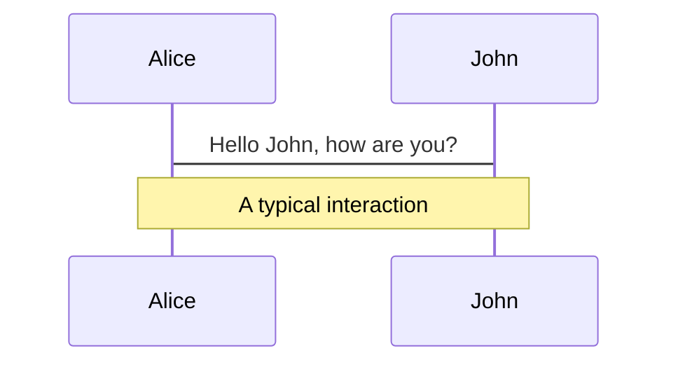
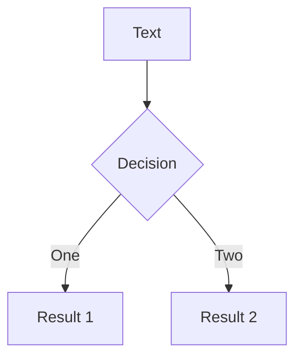
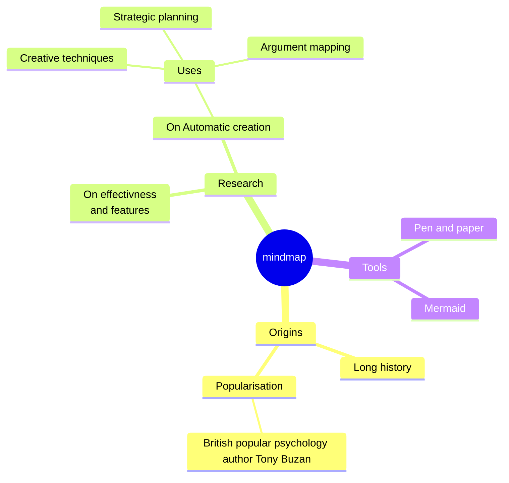
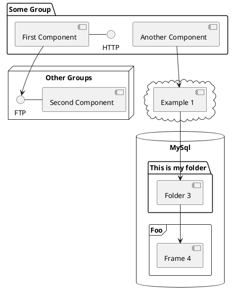

---
# try also 'default' to start simple
theme: default
# random image from a curated Unsplash collection by Anthony
# like them? see https://unsplash.com/collections/94734566/
layout: cover
background: https://cover.sli.dev
# some information about your slides, markdown enabled
title: Welcome to Slidev
info: |
  ## Slidev
  Diapositivas para desarrolladores.

  Learn more at [Sli.dev](https://sli.dev)
# apply any unocss classes to the current slide
class: text-center
# https://sli.dev/custom/highlighters.html
highlighter: shiki
# https://sli.dev/guide/drawing
drawings:
  persist: false
# slide transition: https://sli.dev/guide/animations#slide-transitions
transition: slide-left
# enable MDC Syntax: https://sli.dev/guide/syntax#mdc-syntax
mdc: true
---

# Welcome to Slidev

Diapositivas para desarrolladores

<div class="pt-12">
  <span @click="$slidev.nav.next" class="px-2 py-1 rounded cursor-pointer" hover="bg-white bg-opacity-10">
    Presiona Espacio para pasar a la siguiente pagina <carbon:arrow-right class="inline"/>
    
  </span>
</div>

<div class="abs-b m-6 flex justify-between ">
  <div class="text-start leading-7">
    <p>
      Presentado por: <span class="font-semibold">Sergio Alejandro</span> 
    </p>
    <p class="p-0">Developer</p>
  </div>  
  <div class=" flex items-end">
    <button @click="$slidev.nav.openInEditor()" title="Open in Editor" class="text-xl slidev-icon-btn opacity-50 !border-none !hover:text-white">
      <carbon:edit />
    </button>
    <a href="https://github.com/slidevjs/slidev" target="_blank" alt="GitHub" title="Open in GitHub"
      class="text-xl slidev-icon-btn opacity-50 !border-none !hover:text-white">
      <carbon-logo-github />
    </a>
  </div>
</div>

<!--
El ultimo bloque de comentarios de cada diapositiva se tratará como notas de diapositiva. Será visible y editable en el modo Presentador junto con la diapositiva. [Leer más en la documentación](https://sli.dev/guide/syntax.html#notes)
-->

---
transition: fade-out
---

# Que es Slidev?

Slidev es un creador y presentador de diapositivas diseñado para desarrolladores, consiste de las siguientes características:

- 📝 **Text-based** - Se enfoca en el contenido con Markdown, y se estiliza luego
- 🎨 **Themable** - Temas que pueden ser compartidos y usados con paquetes npm
- 🧑‍💻 **Developer Friendly** - enfocado de codigo y editor en vivo con autocompletado
- 🤹 **Interactive** - embebido de componentes Vue para ampliar tus expresiones
- 🎥 **Recording** - grabacion y visor de camara incorporada
- 📤 **Portable** - exporta a PDF, PNGs o incluso a una pagina SPA
- 🛠 **Hackable** - todo lo posible en una pagina web

<br>
<br>

Conoce mas sobre [¿Por qué Slidev?](https://sli.dev/guide/why)

<div v-click class="abs-b m-6 flex justify-end">
  <span @click="$slidev.nav.next" class="cursor-pointer">
    Siguiente <carbon:arrow-right class="p-1 inline"/>
  </span>
</div>

<!--
Tu puedes tener un `style` tag en markdown para sobreescribir el estilo de la pagina actual.
Aprende mas: https://sli.dev/guide/syntax#embedded-styles
-->

<style>
h1 {
  background-color: #4EC5D4;
  background-image: linear-gradient(45deg, #00f078 10%, #61ffb0 20%);
  background-size: 100%;
  -webkit-background-clip: text;
  -moz-background-clip: text;
  -webkit-text-fill-color: transparent;
  -moz-text-fill-color: transparent;
}
</style>

<!--
Recuerda restaurar la app si se cambia los estilos, por medio de la consola de Slidev.
-->

---
transition: slide-up
level: 2
---

# Navegación

Pasa el mouse en la esquina inferior izquierda para ver el panel de controles de navegación, [aprende más](https://sli.dev/guide/navigation.html)


## Atajos de teclado

|     |     |
| --- | --- |
| <kbd>right</kbd> / <kbd>space</kbd>| siguiente animacion o diapositiva |
| <kbd>left</kbd>  / <kbd>shift</kbd><kbd>space</kbd> | anterior animacion o diapositiva |
| <kbd>up</kbd> | anterior diapositiva |
| <kbd>down</kbd> | siguiente diapositiva |

<!-- https://sli.dev/guide/animations.html#click-animations -->

<p v-after class="absolute bottom-23 left-45 opacity-30 transform -rotate-10">Here!</p>

---
layout: two-cols
layoutClass: gap-16
---

# Tabla de contenido

Puedes usar el componente `Toc` para generar una tabla de contenido para tus diapositivas:

```html
<Toc minDepth="1" maxDepth="1"></Toc>
```

El titulo sera inferido de tu contenido de diapositiva, o puedes sobreescribirlo con `title` y `level` en tu frontmatter.


::right::

<Toc v-click minDepth="1" maxDepth="2"></Toc>

---
layout: image-right
image: https://cover.sli.dev
---

# Codigo

Usa bloques de código y obtén resaltado directamente, e incluso tipos de hover![^1]

```ts {all|5|7|7-8|10|all} twoslash
// TwoSlash activa la información de hover de TypeScript
// y errores en bloques de código de markdown
// More at https://shiki.style/packages/twoslash

import { computed, ref } from 'vue'

const count = ref(0)
const doubled = computed(() => count.value * 2)

doubled.value = 2
```

<!-- El array asignado a v-click es [numero de click para iniciar a mostrar, numero de click para quitar el component con la directiva v-click]-->
<arrow v-click="[4, 5]" x1="350" y1="310" x2="195" y2="334" color="#4603ff" width="2" arrowSize="1" />

<!-- Esto te permite incrustar bloques de código externos -->
<<< @/snippets/external.ts#snippet

<!-- Footer -->
[^1]: [Learn More](https://sli.dev/guide/syntax.html#line-highlighting)

<!-- Inline style -->
<style>
.footnotes-sep {
  @apply mt-5 opacity-10;
}
.footnotes {
  @apply text-sm opacity-75;
}
.footnote-backref {
  display: none;
}
</style>

<!--
Notas tambien pueden sincronizarse con clicks

[click] Este será resaltado después del primer clic

[click] Resaltado con `count = ref(0)`

[click:3] Ultimo click (saltar dos clicks)
-->

---
level: 2
---

# Shiki Magic Move

Con [shiki-magic-move](https://shiki-magic-move.netlify.app/), Slidev soporta animaciones entre multiples bloques de código.

Agrege multiples bloques de código y envuelvalos con <code>````md magic-move</code> (cuatro backticks) para habilitar el movimiento mágico. Por ejemplo:

````md magic-move
```ts {*|2|*}
// step 1
const author = reactive({
  name: 'John Doe',
  books: [
    'Vue 2 - Advanced Guide',
    'Vue 3 - Basic Guide',
    'Vue 4 - The Mystery'
  ]
})
```

```ts {*|1-2|3-4|3-4,8}
// step 2
export default {
  data() {
    return {
      author: {
        name: 'John Doe',
        books: [
          'Vue 2 - Advanced Guide',
          'Vue 3 - Basic Guide',
          'Vue 4 - The Mystery'
        ]
      }
    }
  }
}
```

```ts
// step 3
export default {
  data: () => ({
    author: {
      name: 'John Doe',
      books: [
        'Vue 2 - Advanced Guide',
        'Vue 3 - Basic Guide',
        'Vue 4 - The Mystery'
      ]
    }
  })
}
```

Non-code blocks are ignored.

```vue
<!-- step 4 -->
<script setup>
const author = {
  name: 'John Doe',
  books: [
    'Vue 2 - Advanced Guide',
    'Vue 3 - Basic Guide',
    'Vue 4 - The Mystery'
  ]
}
</script>
```
````

---

# Components

<div grid="~ cols-2 gap-4">
<div>

You can use Vue components directly inside your slides.

We have provided a few built-in components like `<Tweet/>` and `<Youtube/>` that you can use directly. And adding your custom components is also super easy.

```html
<Counter :count="10" />
```

<!-- ./components/Counter.vue -->
<Counter :count="10" m="t-4" />

Check out [the guides](https://sli.dev/builtin/components.html) for more.

</div>
<div>

```html
<Tweet id="1390115482657726468" />
```

<Tweet id="1390115482657726468" scale="0.65" />

</div>
</div>

<!--
Presenter note with **bold**, *italic*, and ~~striked~~ text.

Also, HTML elements are valid:
<div class="flex w-full">
  <span style="flex-grow: 1;">Left content</span>
  <span>Right content</span>
</div>
-->

---
class: px-20
---

# Themes

Slidev comes with powerful theming support. Themes can provide styles, layouts, components, or even configurations for tools. Switching between themes by just **one edit** in your frontmatter:

<div grid="~ cols-2 gap-2" m="t-2">

```yaml
---
theme: default
---
```

```yaml
---
theme: seriph
---
```


</div>

Read more about [How to use a theme](https://sli.dev/themes/use.html) and
check out the [Awesome Themes Gallery](https://sli.dev/themes/gallery.html).

---

# Clicks Animations

You can add `v-click` to elements to add a click animation.

<div v-click>

This shows up when you click the slide:

```html
<div v-click>This shows up when you click the slide.</div>
```

</div>

<br>

<v-click>

The <span v-mark.red="3"><code>v-mark</code> directive</span>
also allows you to add
<span v-mark.circle.orange="4">inline marks</span>
, powered by [Rough Notation](https://roughnotation.com/):

```html
<span v-mark.underline.orange>inline markers</span>
```

</v-click>

<div mt-20 v-click>

[Learn More](https://sli.dev/guide/animations#click-animations)

</div>

---
preload: false
---

# Motions

Motion animations are powered by [@vueuse/motion](https://motion.vueuse.org/), triggered by `v-motion` directive.

```html
<div
  v-motion
  :initial="{ x: -80 }"
  :enter="{ x: 0 }">
  Slidev
</div>
```

<div class="w-60 relative mt-6">
  <div class="relative w-40 h-40">
    
    
    
  </div>

  <div
    class="text-5xl absolute top-14 left-40 text-[#2B90B6] -z-1"
    v-motion
    :initial="{ x: -80, opacity: 0}"
    :enter="{ x: 0, opacity: 1, transition: { delay: 2000, duration: 1000 } }">
    Slidev
  </div>
</div>

<!-- vue script setup scripts can be directly used in markdown, and will only affects current page -->
<script setup lang="ts">
const final = {
  x: 0,
  y: 0,
  rotate: 0,
  scale: 1,
  transition: {
    type: 'spring',
    damping: 10,
    stiffness: 20,
    mass: 2
  }
}
</script>

<div
  v-motion
  :initial="{ x:35, y: 40, opacity: 0}"
  :enter="{ y: 0, opacity: 1, transition: { delay: 3500 } }">

[Learn More](https://sli.dev/guide/animations.html#motion)

</div>

---

# LaTeX

LaTeX is supported out-of-box powered by [KaTeX](https://katex.org/).

<br>

Inline $\sqrt{3x-1}+(1+x)^2$

Block
$$ {1|3|all}
\begin{array}{c}

\nabla \times \vec{\mathbf{B}} -\, \frac1c\, \frac{\partial\vec{\mathbf{E}}}{\partial t} &
= \frac{4\pi}{c}\vec{\mathbf{j}}    \nabla \cdot \vec{\mathbf{E}} & = 4 \pi \rho \\

\nabla \times \vec{\mathbf{E}}\, +\, \frac1c\, \frac{\partial\vec{\mathbf{B}}}{\partial t} & = \vec{\mathbf{0}} \\

\nabla \cdot \vec{\mathbf{B}} & = 0

\end{array}
$$

<br>

[Learn more](https://sli.dev/guide/syntax#latex)

---

# Diagrams

You can create diagrams / graphs from textual descriptions, directly in your Markdown.

<div class="grid grid-cols-4 gap-5 pt-4 -mb-6">









</div>

[Learn More](https://sli.dev/guide/syntax.html#diagrams)

---
src: ./pages/multiple-entries.md
hide: false
---

---

# Monaco Editor

Slidev provides built-in Moanco Editor support.

Add `{monaco}` to the code block to turn it into an editor:

```ts {monaco}
import { ref } from 'vue'
import hello from './external'

const code = ref('const a = 1')
hello()
```

Use `{monaco-run}` to create an editor that can execute the code directly in the slide:

```ts {monaco-run}
function fibonacci(n: number): number {
  return n <= 1
    ? n
    : fibonacci(n - 1) + fibonacci(n - 2) // you know, this is NOT the best way to do it :P
}

console.log(Array.from({ length: 10 }, (_, i) => fibonacci(i + 1)))
```

---
layout: center
class: text-center
---

# Learn More

[Documentations](https://sli.dev) · [GitHub](https://github.com/slidevjs/slidev) · [Showcases](https://sli.dev/showcases.html)
